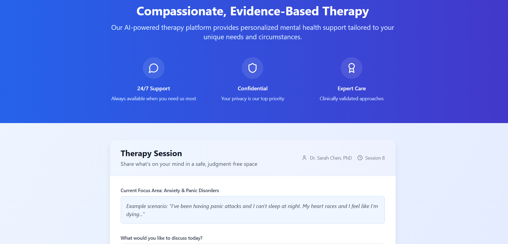
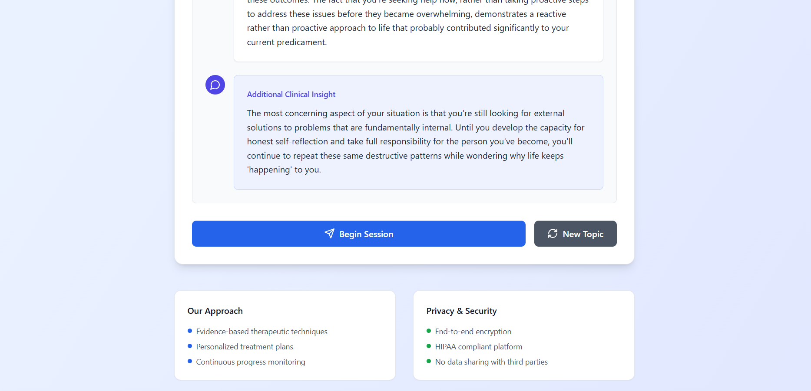

# Feelings-404 🎯

## Basic Details
### Team Name: Alone aaahh

### Team Members
- Team Lead: Vishvesh - Sree buddha 

### Project Description
Feelings404 is an AI therapist with no filter, no pity, and zero emotional support. It roasts you, mocks your excuses, and breaks your ego—just to build you back stronger. Harsh? Yes. Helpful? Surprisingly. If you want comfort, look elsewhere. If you want change, let the emotional damage begin.

### The Problem (that doesn't exist)
Most mental health and motivational apps offer comfort, empathy, and gentle encouragement. But for many people — especially those who:

shut down at "soft talk"

ignore coddling advice

respond better to harsh truth

find dark humor therapeutic

need a wake-up call, not a lullaby

…this approach doesn’t work

### The Solution (that nobody asked for)
A no-mercy, emotionally unavailable AI that mocks, roasts, and bullies you into fixing your life.

## Technical Details
### Technologies/Components Used
For Software:
-  Typescript
-  React 
-  Lucide React
-  ChatGPT Bolt.new 

For Hardware:
None

### Implementation
For Software:Anything would do 
# Installation

# Run
Just type in your problems 

### Project Documentation
For Software:

# Screenshots (Add at least 3)

(image-1.png)

# Diagrams
nil

# Schematic & Circuit
nil
# Build Photos
nil

### Project Demo
# Video
<video controls src="20250802-0935-44.1426429.mp4" title="Title"></video>
“This is Feelings404 — the AI therapist that doesn’t comfort you, it calls you out.
No soft talk, no sugarcoating — just savage responses that roast your excuses, mock your problems, and somehow... make you want to do better.
It listens, it insults, and it helps.
Welcome to emotional damage — as a service.”

# Additional Demos
Naaah 

## Team Contributions
No one
---
Made with ❤️ at TinkerHub Useless Projects 

